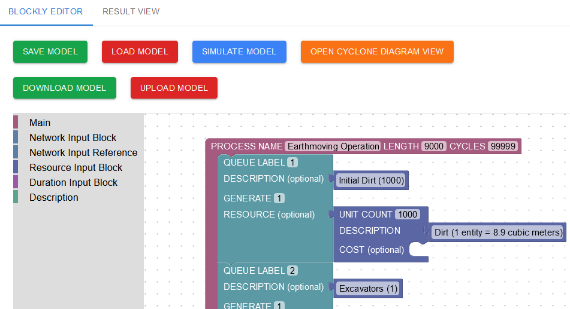
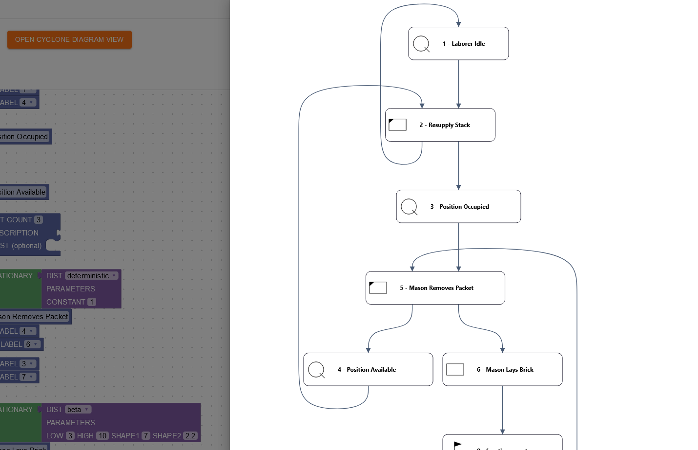
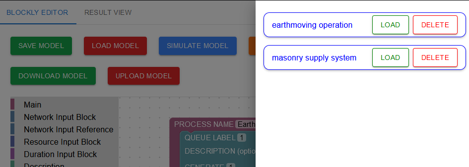
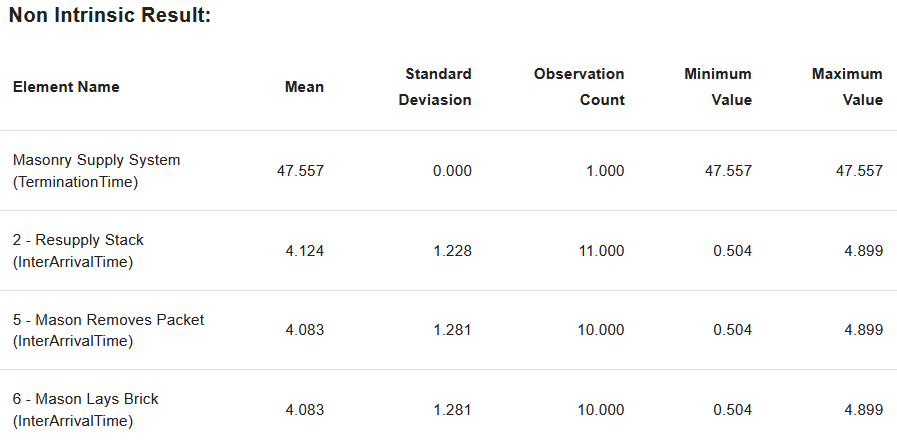

# CYCLONE Frontend (Blockly)

This is the frontend blockly editor for the CYCLONE model

Framework / Language Used:
- React
- Typescript
- Tailwind CSS
- [reaflow](https://github.com/reaviz/reaflow)

App created using Vite

## Deployment

Build the application using docker. A Dockerfile is provided.\
A docker compose file is also provided to bring up the application.\
Update the environment variable `VITE_API_URL` (As seen in `.env` and under `args` in `docker-compose.yml`) to the URL of the [CYCLONE Backend](https://github.com/flyrobot27/cyclone-backend), which is provided here under `cyclone-backend`.\
The app will be listening on Port 5173

## Overview
This application allows for the creation of [CYCLONE](https://engineering.purdue.edu/CEM/people/Personal/Halpin/Sim/index_html) simulation models with [Google's Blockly](https://github.com/google/blockly) Visual Programming tool.

The Blockly Editor allows for editing of each CYCLONE components:\

You can also visualize the model as a compute graph, if that's preferred:\

You can also save and load existing models from database (Load Model):\
\
2 Models are provided under `evaluation models`. You can upload them with "Upload Model" button.

The results are viewable from the "Result View" Tab:\

