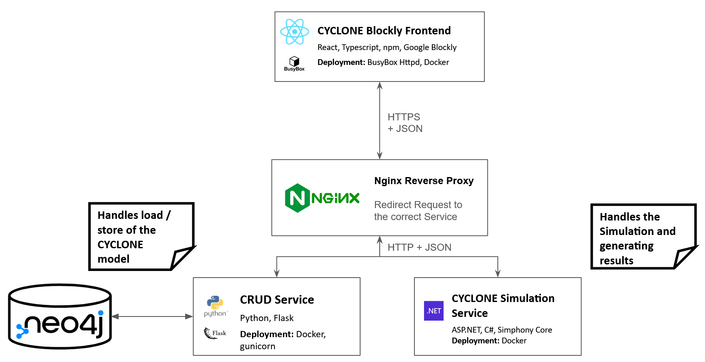

# CYCLONE (Blockly)

This is the repository hosting the blockly editor for the CYCLONE model. Both the frontend and backend are included

## Framework / Language Used

### Frontend
- React
- Typescript
- Tailwind CSS
- [reaflow](https://github.com/reaviz/reaflow)

App created using Vite

### Backend
- .NET 8.0
- C#
- Flask
- Python
- [Simphony](https://www.ualberta.ca/engineering/research/groups/construction-simulation/simphony.html) Modified for .NET 8.0
## Deployment
Here is the overall architecture of the system:\

### Frontend
Build the application using docker. A Dockerfile is provided. A docker compose file is also provided to bring up the application.

Update the environment variable `VITE_API_URL` (As seen in `.env` and under `args` in `docker-compose.yml`) to the URL of the [CYCLONE Backend](https://github.com/flyrobot27/cyclone-backend), which is provided here under `cyclone-backend`.

The app will be listening on Port 5173

### Backend
When cloning the repository, clone the submodule `cyclone-backend`. Navigate into the submodule

Inside, there is a provided docker compose file. The `environment` section contains all the environment variables which specifies the authentication information for the Neo4j Database. Change to a more secure password if desired.

The docker compose will bring up 2 applications. One for handling the simulation and another for handling database load / store of models. These 2 applications are listening on 2 different port (defaults are `5000` and `8080`)

A reverse proxy web server is expected to be installed on the backend server. There is an example `sample-nginx-default` which shows how the backend should be configured for Nginx.

## Overview
This application allows for the creation of [CYCLONE](https://engineering.purdue.edu/CEM/people/Personal/Halpin/Sim/index_html) simulation models with [Google's Blockly](https://github.com/google/blockly) Visual Programming tool.

The Blockly Editor allows for editing of each CYCLONE components:\

You can also visualize the model as a compute graph, if that's preferred:\

You can also save and load existing models from database (Load Model):\
\
2 Models are provided under `evaluation models`. You can upload them with "Upload Model" button.

The results are viewable from the "Result View" Tab:\

